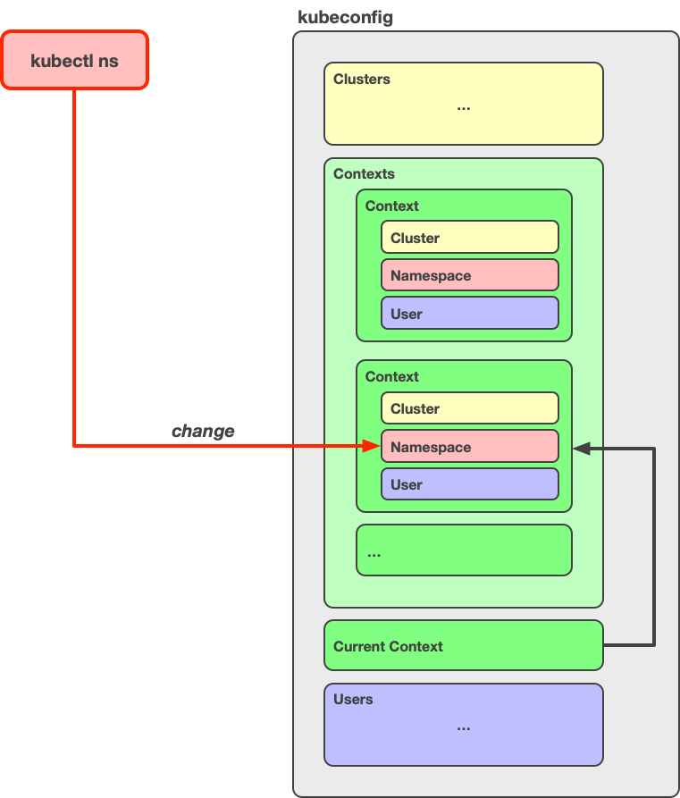

# kubectl ns

A kubectl [plugin](https://kubernetes.io/docs/tasks/extend-kubectl/kubectl-plugins/) for interactively switching between namespaces in your cluster:

This makes it easier to work with different namespaces in the same cluster.

Also see [kubectl-ctx](https://github.com/weibeld/kubectl-ctx) for switching between contexts (e.g. clusters).

## Installation

To install the plugin, simply download the `kubectl-ns` file and save it in any directory that is in your `PATH`:

~~~bash
curl -O https://raw.githubusercontent.com/weibeld/kubectl-ns/master/kubectl-ns
~~~

Then, make the `kubectl-ns` file executable:

~~~bash
chmod +x kubectl-ns
~~~

Now, you can verify that the plugin is correctly installed by running the following command:

~~~bash
kubectl plugin list
~~~~

This lists all the plugins that `kubectl` detected, and the `kubectl-ns` plugin should now be listed there.

To uninstall the plugin, simply delete the `kubectl-ns` file.

## Usage

Switch to another namespace of this cluster:

~~~bash
kubectl ns
~~~

List all namespaces of this cluster:

~~~bash
kubectl ns -l
~~~

Update the local namespaces cache for this cluster:

~~~bash
kubectl ns -u
~~~

### Cache

The `ns -u` command gets the list of namespaces of the cluster from the API server and saves them in the `~/.kube/kubectl-ns` directory. The `ns` and `ns -l` commands get the list of namespaces that they display to you from this cache. This allows for **faster operation** since these commands now don't need to contact the API server anymore.

The `ns` and `ns -l` commands check whether a cache exists, and if not, they create it. So, there's no need to run `ns -u` before running either of these commands.

If there happen any changes to the namespaces of your cluster (e.g. a namespace is created or deleted), you can run the `ns -u` command to update the local cache.

## How It Works

When you run `kubectl ns`, the plugin changes your local [*kubeconfig*](https://kubernetes.io/docs/concepts/configuration/organize-cluster-access-kubeconfig/) configuration as shown below:

As you can see, the plugin changes the **namespace** element of the **current context** in your *kubeconfig* configuration (the plugin always works on the current context).

This means that the next time you use `kubectl`, it will use the new namespace for the same cluster.

Note that the `ns` command physically changes one of your *kubeconfig* files (the default *kubeconfig* file is `~/.kube/config`, but you can have multiple *kubeconfig* files by by listing them in the [`KUBECONFIG`](https://kubernetes.io/docs/concepts/configuration/organize-cluster-access-kubeconfig/#the-kubeconfig-environment-variable) environment variable).

The `ns -l` command displays the namespaces of the **cluster** which is referenced by your current context.

## Dependencies

The plugin depends on the [fzf](https://github.com/junegunn/fzf) command being available on your system.

You can install fzf as follows:

- Homebrew (macOS) and Linuxbrew (Linux):
    ~~~bash
    brew install fzf
    ~~~
- From source (macOS and Linux):
    ~~~bash
    git clone https://github.com/junegunn/fzf.git ~/.fzf
    ~/.fzf/install
    ~~~
- For further installation options, see [here](https://github.com/junegunn/fzf#installation)
